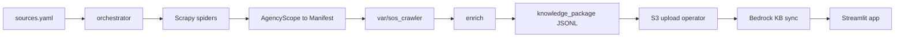
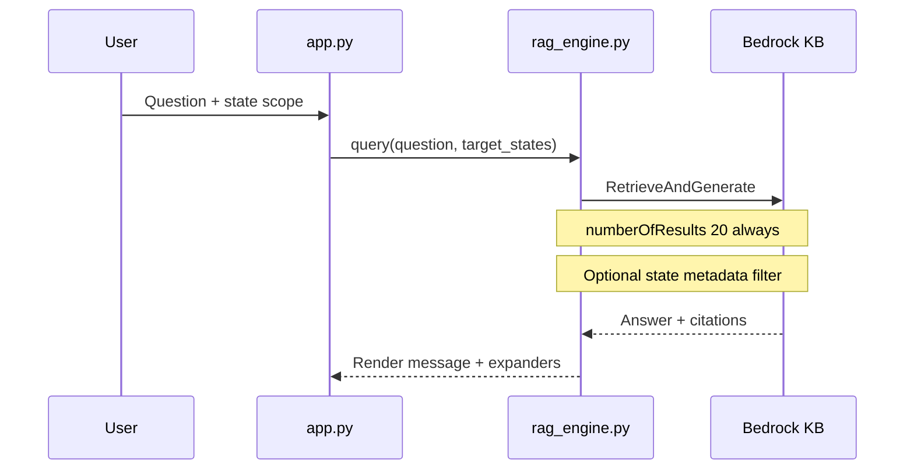
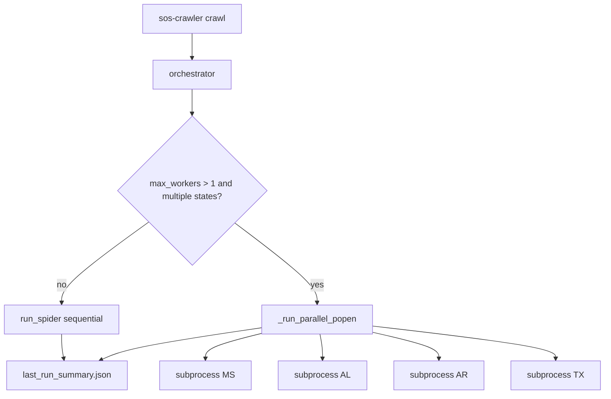
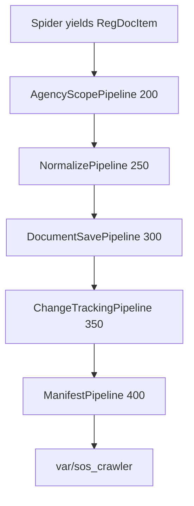

# Detailed operations guide

This document is the comprehensive reference for running and operating the SoS Regulatory Intelligence Platform. For a shorter Hub-oriented overview, see [README.md](../README.md). For Streamlit Cloud and AWS setup, see [setup.md](setup.md).

---

## Table of contents

1. [System overview](#system-overview)
2. [Repository map](#repository-map)
3. [Prerequisites matrix](#prerequisites-matrix)
4. [Environment variables](#environment-variables)
5. [Quick commands](#quick-commands)
6. [CLI reference](#cli-reference)
7. [Command recipes](#command-recipes)
8. [Parallel execution](#parallel-execution)
9. [Per-state spiders](#per-state-spiders)
10. [Target agencies by state](#target-agencies-by-state)
11. [Crawler data flow and pipelines](#crawler-data-flow-and-pipelines)
12. [Runtime outputs](#runtime-outputs)
13. [RAG assistant](#rag-assistant)
14. [Configuration files](#configuration-files)
15. [Indexing and AWS](#indexing-and-aws)
16. [Automation: CI, Docker, Lambda](#automation-ci-docker-lambda)
17. [Validation and debugging](#validation-and-debugging)
18. [Known gotchas](#known-gotchas)
19. [Related documentation](#related-documentation)

---

## System overview

The platform has two connected systems:

1. **Regulatory crawler** (`src/sos_crawler/`) — Scrapy spiders collect administrative rules from seven state sources, normalize metadata, save documents locally, and write JSONL manifests.
2. **RAG assistant** (`src/app.py`, `src/rag_engine.py`) — Streamlit UI queries an Amazon Bedrock Knowledge Base and returns answers with citations.

Mississippi is the **primary reference state** for citation URL patterns and indexing conventions.

### End-to-end data flow



Indexing (S3 upload and Bedrock sync) is **operator-driven** in this repository; see [Indexing and AWS](#indexing-and-aws).

### RAG request path



---

## Repository map

```
AI-Innovation-Phase-1/
├── README.md                 # Hub overview + quickstart
├── LICENSE
├── .env.example              # Local env template (copy to .env)
├── CHANGELOG.md
├── docs/
│   ├── DETAIL.md             # This file
│   ├── architecture.md
│   ├── setup.md
│   ├── data-notes.md
│   ├── limitations.md
│   └── testing.md
├── src/
│   ├── app.py                # Streamlit RAG UI
│   ├── rag_engine.py         # Bedrock RetrieveAndGenerate
│   ├── style.css
│   └── sos_crawler/
│       ├── cli.py            # sos-crawler entrypoint
│       ├── orchestrator.py   # Multi-state runs + parallelism
│       ├── pipelines.py      # Item processing
│       ├── items.py          # RegDocItem schema
│       ├── paths.py          # var/sos_crawler/ helpers
│       ├── config_data/
│       │   ├── sources.yaml
│       │   └── agency_allowlists.yaml
│       ├── spiders/          # mississippi, alabama, arkansas, ...
│       └── tools/
│           ├── qa.py
│           └── enrich.py
├── scripts/
│   ├── upload_to_s3.py       # Legacy MS data/ upload helper
│   └── generate_metadata.py
├── .github/workflows/
│   └── crawl.yml             # Scheduled CI crawl
├── Dockerfile                # Crawler + Playwright image
├── docker-compose.yml
└── pyproject.toml            # uv project; sos-crawler script

var/sos_crawler/              # GENERATED — gitignored
├── logs/                     # Per-state Scrapy logs + run.log
├── output/                   # Manifests, indexes, knowledge packages
├── downloads/{STATE}/        # Saved document bodies
└── cache/                    # HTTP / tldextract cache
```

All crawler artifacts must use [paths.py](../src/sos_crawler/paths.py) helpers — never hardcode `output/` or `downloads/` at the repo root.

---

## Prerequisites matrix

| Goal | Requirements |
|------|----------------|
| **RAG app only** | Python 3.12+, [uv](https://github.com/astral-sh/uv), `uv sync`, AWS credentials, `BEDROCK_KB_ID`, `APP_PASSWORD` |
| **Crawler — HTTP states** (AR, GA, LA, TN) | Above minus Bedrock; outbound HTTPS |
| **Crawler — Playwright states** (MS, AL, TX) | + `uv run playwright install chromium` |
| **Full crawl pipeline** | Crawl + `--run-qa` + `--run-enrichment`; then operator S3/KB steps |
| **Docker crawler** | Docker or Docker Compose; volume-mount `var/sos_crawler` |

---

## Environment variables

### RAG assistant (`.env` or `.streamlit/secrets.toml`)

| Variable | Required | Description |
|----------|----------|-------------|
| `AWS_ACCESS_KEY_ID` | Local dev | Omit when using IAM instance/profile roles |
| `AWS_SECRET_ACCESS_KEY` | Local dev | |
| `AWS_DEFAULT_REGION` | Yes | Must match Bedrock KB region (e.g. `us-east-1`) |
| `BEDROCK_KB_ID` | Yes | Your Knowledge Base ID |
| `BEDROCK_MODEL_ARN` | No | Defaults to Amazon Nova Pro in `rag_engine.py` |
| `APP_PASSWORD` | Yes | Streamlit login gate |

### Crawler

| Variable | Default | Description |
|----------|---------|-------------|
| `SOS_CRAWLER_RUNTIME_DIR` | `var/sos_crawler/` | All logs, output, downloads, cache |
| `SOS_CRAWLER_CONFIG_DIR` | Packaged `config_data/` | Override `sources.yaml` and allowlists |
| `CRAWLER_MODE` | `full` | Set by orchestrator: `full` or `designated` |
| `AGENCY_ALLOWLIST_FILE` | Set by orchestrator | Absolute path to materialized allowlist in runtime |
| `PLAYWRIGHT_HEADLESS` | `true` | Set `false` to watch browser during debug |
| `MS_CODESEARCH_RETRIES` | `4` | Mississippi CodeSearch retry limit |
| `AWS_LAMBDA_FUNCTION_NAME` | — | When set, runtime dir defaults to `/tmp/sos_crawler` and parallel workers are forced to `1` |
| `MAX_RETRIES` | `1` | Used by programmatic `run_spiders()` (Lambda), not CLI default |
| `S3_BUCKET_NAME` | See script | Used by `scripts/upload_to_s3.py` only |

CLI flags `--runtime-dir` and `--config-dir` set `SOS_CRAWLER_RUNTIME_DIR` and `SOS_CRAWLER_CONFIG_DIR` before any crawl logic runs.

---

## Quick commands

```bash
# Install
uv sync
uv run playwright install chromium

# RAG assistant
cp .env.example .env   # edit credentials
uv run streamlit run src/app.py

# Minimal crawler smoke (HTTP only, designated agencies)
uv run sos-crawler crawl --states AR --mode designated

# Full operator pipeline (matches CI style)
uv run sos-crawler crawl --run-qa --run-enrichment --max-retries 2

# Post-process an existing crawl directory
uv run sos-crawler qa
uv run sos-crawler enrich
```

---

## CLI reference

Entry point: `sos-crawler` (defined in `pyproject.toml` as `sos_crawler.cli:main`).

### `sos-crawler crawl`

| Flag | Default | Description |
|------|---------|-------------|
| `--states` | All in `sources.yaml` | Space-separated state IDs: `MS AL AR GA LA TN TX` |
| `--mode` | `full` | `full` = all scraped items; `designated` = filter to three agency types via allowlist |
| `--max-retries` | `1` | Per-state retry attempts on non-zero Scrapy exit code |
| `--max-workers` | `4` | Max concurrent **state** subprocesses (local only) |
| `--run-qa` | off | Run [qa.py](../src/sos_crawler/tools/qa.py) after crawl |
| `--run-enrichment` | off | Run [enrich.py](../src/sos_crawler/tools/enrich.py) after crawl |
| `--runtime-dir` | `var/sos_crawler` | Override artifact root |
| `--config-dir` | packaged | Override YAML config location |

**Exit code:** `0` if all selected states succeed; `1` if any state fails. QA/enrichment failures raise the exit code via `max()`.

**State → spider mapping** (from [orchestrator.py](../src/sos_crawler/orchestrator.py)):

| State | Scrapy spider name |
|-------|-------------------|
| MS | `mississippi` |
| AL | `alabama` |
| AR | `arkansas` |
| GA | `georgia` |
| LA | `louisiana` |
| TN | `tennessee` |
| TX | `texas` |

### `sos-crawler qa`

| Flag | Description |
|------|-------------|
| `--runtime-dir` | Artifact root (also `SOS_CRAWLER_RUNTIME_DIR`) |

Checks:

- `output/last_run_summary.json` exists and `total > 0`
- At least one `manifest_*.jsonl` exists
- Each manifest line has: `state`, `doc_url`, `fetched_at`, `rule_status`, `citation_normalized`

### `sos-crawler enrich`

| Flag | Description |
|------|-------------|
| `--runtime-dir` | Artifact root |

Reads all `output/manifest_*.jsonl`, chunks `extracted_text` (default 1200 chars, 200 overlap), writes `output/knowledge_package_{timestamp}.jsonl`.

### Direct Scrapy (debug single spider)

```bash
uv run python -m scrapy crawl arkansas
PLAYWRIGHT_HEADLESS=false uv run python -m scrapy crawl alabama
```

Direct Scrapy bypasses the orchestrator summary file unless you run `sos-crawler qa` afterward (QA requires `last_run_summary.json` from an orchestrated crawl).

---

## Command recipes

| Scenario | Command |
|----------|---------|
| Designated agencies, selected states | `uv run sos-crawler crawl --states AL AR TX --mode designated` |
| All configured states, parallel (default 4 workers) | `uv run sos-crawler crawl` |
| Sequential (debug / low memory) | `uv run sos-crawler crawl --max-workers 1` |
| CI-style full pipeline | `uv run sos-crawler crawl --run-qa --run-enrichment --max-retries 2` |
| Single fast HTTP state | `uv run sos-crawler crawl --states AR --mode designated --max-retries 0` |
| Crawl then QA/enrich separately | `uv run sos-crawler crawl --states GA` then `uv run sos-crawler qa` and `uv run sos-crawler enrich` |
| Custom artifact directory | `uv run sos-crawler crawl --runtime-dir /tmp/sos_test --states TN` |
| Custom config (staging URLs) | `uv run sos-crawler crawl --config-dir /path/to/config` |
| Visible Playwright browser | `PLAYWRIGHT_HEADLESS=false uv run python -m scrapy crawl texas` |
| Docker Compose | `docker compose run --rm crawler uv run sos-crawler crawl --states TX --max-retries 0` |

GitHub Actions (`.github/workflows/crawl.yml`):

- **Schedule:** daily 03:00 UTC, all states, `full` mode
- **Manual:** `workflow_dispatch` with optional `mode` input (`full` or `designated`)
- **Command:** `uv run sos-crawler crawl --mode "..." --run-qa --run-enrichment --max-retries 2`
- **Artifacts:** `var/sos_crawler/` uploaded for 90 days (not committed to git)

---

## Parallel execution

The orchestrator does **not** run multiple states inside one Scrapy process. Each state is a separate `python -m scrapy crawl <spider>` subprocess.



| Condition | Behavior |
|-----------|----------|
| `--max-workers 1` | States run one after another |
| Single state in `--states` | Always one subprocess |
| `AWS_LAMBDA_FUNCTION_NAME` set | Workers forced to `1` (logged) |
| Default `--max-workers 4`, 7 states | Up to 4 concurrent; remaining states start as slots free |
| `--max-retries N` | Each state may be re-queued up to N additional attempts on failure |

**Logs:** `var/sos_crawler/logs/{STATE}_{timestamp}.log` (combined Scrapy stdout/stderr).

**Summary:** `var/sos_crawler/output/last_run_summary.json` — per-state `ok`, `elapsed_s`, `output`, `logfile`.

**When to lower `--max-workers`:** MS, AL, and TX use Playwright/Chromium; running three browser-heavy states concurrently can exhaust memory on a laptop. Try `--max-workers 2` or `1` if subprocesses fail or hang.

---

## Per-state spiders

| State | Spider | Transport | Site notes |
|-------|--------|-----------|------------|
| MS | `mississippi` | Playwright + HTTP | Adminsearch iframe → CodeSearch JSON API → PDF download |
| AL | `alabama` | Playwright | React SPA — use `wait_until: domcontentloaded`, not `networkidle` |
| AR | `arkansas` | HTTP only | JSON tree API — do not add Playwright |
| TX | `texas` | Playwright | Appian portal SPA — chapter links use `href="#"` |
| GA | `georgia` | HTTP only | Server-rendered chapter pages; one item per rule on chapter URL |
| LA | `louisiana` | HTTP only | DOCX download + XML parse (Title 46 parts) |
| TN | `tennessee` | HTTP only | Chapter PDFs + pdfplumber text split |

Entry URLs and agency metadata: [sources.yaml](../src/sos_crawler/config_data/sources.yaml). Change URLs there, not in spider constants when possible.

---

## Target agencies by state

Three agency **types** per state (where published):

| Type | Mississippi | Alabama | Arkansas | Texas | Georgia | Louisiana | Tennessee |
|------|-------------|---------|----------|-------|---------|-----------|-----------|
| `dental` | MS Board of Dental Examiners | Agency 270 | Ch. XXI (ch. 84) | Title 22 Part 5 | Dept 150 | Title 46 Part XXXIII | Prefix 0460 |
| `medical-licensure` | MS Board of Medical Licensure | Agency 545 | Ch. XXIV (ch. 173) | Title 22 Part 9 | Dept 360 | Title 46 Part XLV | Prefix 0880 |
| `real-estate` | MS Real Estate Commission | Agency 790 | Ch. XXXIX (ch. 258) | Title 22 Part 23 | Dept 520 | Title 46 Part LXVII (Subpart 1) | Prefix 1260 |

In `--mode designated`, [AgencyScopePipeline](../src/sos_crawler/pipelines.py) drops items whose `agency`, `title`, `doc_url`, or `source_url` do not match substrings in [agency_allowlists.yaml](../src/sos_crawler/config_data/agency_allowlists.yaml) (case-insensitive).

---

## Crawler data flow and pipelines



| Pipeline | Role |
|----------|------|
| `AgencyScopePipeline` | Drops out-of-scope agencies in `designated` mode |
| `NormalizePipeline` | Fills `citation_normalized`, `rule_status`, `source_system` |
| `DocumentSavePipeline` | Writes `_body` to `downloads/{STATE}/` using explicit `filename` |
| `ChangeTrackingPipeline` | Updates `output/state_index_{STATE}.json` (hash, timestamps) |
| `ManifestPipeline` | Appends JSONL line to `output/manifest_{spider}_{date}.jsonl` |

### Required item fields (spider authors)

Every spider should set on each `RegDocItem`:

| Field | Notes |
|-------|-------|
| `state`, `state_name` | Two-letter code and full name |
| `agency`, `agency_id` | Must match allowlist substrings in designated mode |
| `doc_url`, `source_url` | Canonical and parent URLs |
| `filename` | **Explicit** — URL query strings are not valid filenames |
| `doc_type`, `rule_status` | Typically `"rule"` |
| `title`, `citation` | Human-readable; citation format: `State \| Agency \| Hierarchy \| Rule ID` |
| `extracted_text` | Plain text for RAG chunking |
| `_body` | `extracted_text.encode("utf-8")` for text spiders |
| `fetched_at` | ISO UTC timestamp |
| `hash_md5`, `size_bytes`, `content_type` | From body bytes |

**`extracted_text` header template** (text spiders):

```
STATE: Alabama (AL)
AGENCY: Board of Dental Examiners of Alabama
CHAPTER: 270-X-1 — Internal Board Matters
RULE: 270-X-1-.01 — Oath Of Office
SOURCE: https://...

[rule body]

STATUTORY AUTHORITY: ...
HISTORY: ...
```

Playwright spiders must close pages in `finally` and use `errback_close_page` on failures.

---

## Runtime outputs

| Path | Description |
|------|-------------|
| `logs/run.log` | Orchestrator-level log |
| `logs/{STATE}_{ts}.log` | Per-state Scrapy subprocess log |
| `output/manifest_{spider}_{YYYYMMDD}.jsonl` | One JSON object per rule (append) |
| `output/state_index_{STATE}.json` | Change-tracking index |
| `output/{STATE}_{ts}.jsonl` | Scrapy `-o` feed from orchestrator (parallel to manifest) |
| `output/last_run_summary.json` | Last orchestrated run status (required for QA) |
| `output/knowledge_package_{ts}.jsonl` | Chunked records after `enrich` |
| `downloads/{STATE}/...` | Saved document bodies |

Override root: `--runtime-dir` or `SOS_CRAWLER_RUNTIME_DIR`. On Lambda: `/tmp/sos_crawler` unless overridden.

---

## RAG assistant

### Run locally

```bash
uv run streamlit run src/app.py
```

Default URL: `http://localhost:8501`.

### Secrets

| Environment | Location |
|-------------|----------|
| Local | `.env` (from `.env.example`) |
| Streamlit Cloud | `.streamlit/secrets.toml` (gitignored) |

### State scope (sidebar)

- Checkbox grid for MS, AL, AR, GA, LA, TN, TX.
- **Select all** / **Clear all** buttons.
- **Empty selection** = no metadata filter on retrieval (searches full knowledge base).
- **One or more states** = Bedrock filter `state IN [...]`.

### Retrieval behavior ([rag_engine.py](../src/rag_engine.py))

- `numberOfResults: 20` is **always** sent (Bedrock otherwise defaults to 5).
- State filter applied only when the UI passes non-empty `target_states`.
- Model: `BEDROCK_MODEL_ARN` or default Amazon Nova Pro ARN.

### Citations

- Mississippi rules may link to `https://www.sos.ms.gov/adminsearch/ACCode/{filename}`.
- Multi-state indexed documents depend on operator metadata and S3 layout.

---

## Configuration files

### [sources.yaml](../src/sos_crawler/config_data/sources.yaml)

Per-state:

- `entrypoints` — start URLs for spiders
- `sos_home`, `is_primary`, `agencies` — documentation and RAG metadata hints

The orchestrator reads configured state keys; `--states` filters to known IDs in `STATE_SPIDERS`.

### [agency_allowlists.yaml](../src/sos_crawler/config_data/agency_allowlists.yaml)

Substring lists per state for **designated** mode. When adding a state, add matching substrings for the exact `agency` strings your spider emits.

At crawl start, the orchestrator copies the active allowlist to `{runtime}/config/agency_allowlists.yaml` and sets `AGENCY_ALLOWLIST_FILE` for child processes.

---

## Indexing and AWS

### Phase 1 (typical PoC)

- Documents in operator S3 bucket (flat or legacy layout).
- Bedrock Knowledge Base (e.g. OpenSearch Serverless backend).
- **KB sync is manual** — not automated in this repo’s CI.

### Planned Phase 2 S3 layout (reference)

```
s3://bucket/states/{STATE}/{agency_type}/{filename}.txt
s3://bucket/states/{STATE}/{agency_type}/{filename}.txt.metadata.json
```

Bedrock metadata sidecar values must be strings (`state`, `agency_type`, `source_url`, `citation`, etc.).

### Helper scripts

| Script | Purpose |
|--------|---------|
| [scripts/upload_to_s3.py](../scripts/upload_to_s3.py) | Upload from local `data/` folder (legacy MS layout); set `S3_BUCKET_NAME` |
| [scripts/generate_metadata.py](../scripts/generate_metadata.py) | Metadata sidecar generation helper |

After upload, trigger Bedrock ingestion/sync in the AWS console or your automation.

---

## Automation: CI, Docker, Lambda

### GitHub Actions

See [.github/workflows/crawl.yml](../.github/workflows/crawl.yml) — daily crawl, QA, enrichment, artifact upload.

### Docker

```bash
docker build -t sos-crawler .
docker run --rm \
  -v "$PWD/var/sos_crawler:/app/var/sos_crawler" \
  -e SOS_CRAWLER_RUNTIME_DIR=/app/var/sos_crawler \
  sos-crawler uv run sos-crawler crawl --states TX --max-retries 0
```

### Docker Compose

[docker-compose.yml](../docker-compose.yml) — service `crawler`, volume `./var/sos_crawler`, default command shows `--help`.

```bash
docker compose build
docker compose run --rm crawler uv run sos-crawler crawl --states AL --max-retries 0
```

### AWS Lambda

When `AWS_LAMBDA_FUNCTION_NAME` is set:

- Runtime directory → `/tmp/sos_crawler`
- Parallel workers disabled (`max_workers = 1`)
- Use `run_spiders()` from [orchestrator.py](../src/sos_crawler/orchestrator.py) for programmatic invocation

### Distrobox (optional)

For isolated Playwright dependencies on Fedora/other hosts, see [setup.md](setup.md#distrobox-playwright-isolated).

---

## Validation and debugging

### QA tool

```bash
uv run sos-crawler qa
```

### Manifest spot-check

```bash
cat var/sos_crawler/output/manifest_arkansas_$(date +%Y%m%d).jsonl | python3 -c "
import sys, json
for line in sys.stdin:
    r = json.loads(line)
    print(r.get('citation'), r.get('size_bytes'))
"
```

### Inspect first 200 chars of extracted text

```bash
cat var/sos_crawler/output/manifest_arkansas_$(date +%Y%m%d).jsonl | python3 -c "
import sys, json
for line in sys.stdin:
    r = json.loads(line)
    print(r.get('citation'))
    print(repr((r.get('extracted_text') or '')[:200]))
    print()
"
```

### Scrapy stats and drops

```bash
grep -A 30 "Dumping Scrapy stats" var/sos_crawler/logs/AR_*.log | tail -40
grep -i "drop\|scope\|agency" var/sos_crawler/logs/AR_*.log | head -20
grep "response_received_count\|item_scraped_count" var/sos_crawler/logs/AR_*.log
```

### HTTP sanity check (non-JS pages)

```bash
curl -s "https://codeofarrules.arkansas.gov/Rules/Rule?levelType=section&titleID=17&chapterID=84&subChapterID=109&partID=418&subPartID=3947&sectionID=24303" | head -c 500
```

### RAG smoke tests

See [testing.md](testing.md) for evaluation query examples.

---

## Known gotchas

| Issue | Mitigation |
|-------|------------|
| `networkidle` on AL/TX SPAs | Use `wait_until: "domcontentloaded"` + `wait_for_selector()` |
| Arkansas | Use JSON API only — no Playwright |
| Texas chapter links | `href="#"` — extract chapter numbers from `<p>CHAPTER NNN</p>` text |
| Mississippi 0 items | CodeSearch needs iframe cookies; check MS logs for empty `\|0\|` |
| `filename` unset | DocumentSavePipeline uses URL tails — always set explicit `filename` in spiders |
| QA fails after direct Scrapy | Run orchestrated `sos-crawler crawl` to produce `last_run_summary.json` |
| Playwright OOM | Lower `--max-workers` |
| Georgia / LA / TN URL granularity | Some states use chapter-level URLs for multiple rules |

---

## Related documentation

- [architecture.md](architecture.md) — Short architecture summary
- [setup.md](setup.md) — Prerequisites, Streamlit Cloud, Docker, distrobox
- [data-notes.md](data-notes.md) — What is not in git; indexing responsibilities
- [limitations.md](limitations.md) — PoC scope and production gaps
- [testing.md](testing.md) — Manual validation checklist
- [CHANGELOG.md](../CHANGELOG.md) — Release history
