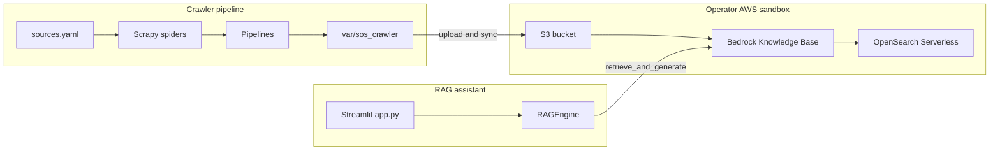

# Architecture

## Overview

This Proof of Concept combines two systems:

1. **Regulatory crawler** (`src/sos_crawler/`) — collects administrative rules from Secretary of State sources across seven states, normalizes metadata, and writes manifests and text artifacts under `var/sos_crawler/`.
2. **RAG assistant** (`src/app.py`, `src/rag_engine.py`) — Streamlit chat UI that queries an Amazon Bedrock Knowledge Base (backed by OpenSearch Serverless) and returns answers with citations.

Mississippi remains the **primary reference state** for citation URLs and indexing conventions. Other states follow the same agency targets (dental, medical licensure, real estate).

For pipeline order, CLI flags, parallel execution, per-state spiders, and debugging, see **[DETAIL.md](DETAIL.md)**.

## Data flow

## RAG request path

1. User selects **state scope** in the sidebar (checkbox grid; empty selection searches the full knowledge base without a metadata filter).
2. `RAGEngine.query()` calls Bedrock **RetrieveAndGenerate** with `numberOfResults: 20` always set, and an optional `state` metadata filter when states are selected.
3. The assistant message is rendered with citation expanders.

Details: [DETAIL.md — RAG assistant](DETAIL.md#rag-assistant).

## Crawler components

| Piece | Role |
|-------|------|
| `orchestrator.py` | Runs spiders per state; optional parallel subprocess pool |
| `pipelines.py` | Agency scope → normalize → save → change tracking → manifest |
| `tools/qa.py` | Post-crawl field validation |
| `tools/enrich.py` | Chunk manifests into knowledge-package JSONL |
| `.github/workflows/crawl.yml` | Scheduled CI crawl (artifacts only) |

Pipeline sequence and item fields: [DETAIL.md — Crawler data flow](DETAIL.md#crawler-data-flow-and-pipelines).

## Deployment context

- **Streamlit UI**: local or Streamlit Cloud — see [setup.md](setup.md).
- **Crawler**: local, Docker, or distrobox — see [DETAIL.md — Automation](DETAIL.md#automation-ci-docker-lambda).
- **Lambda**: `/tmp/sos_crawler` runtime when `AWS_LAMBDA_FUNCTION_NAME` is set.

This repository does **not** include production infrastructure-as-code for Bedrock or OpenSearch; operators supply their own sandbox accounts and indexing workflow.
